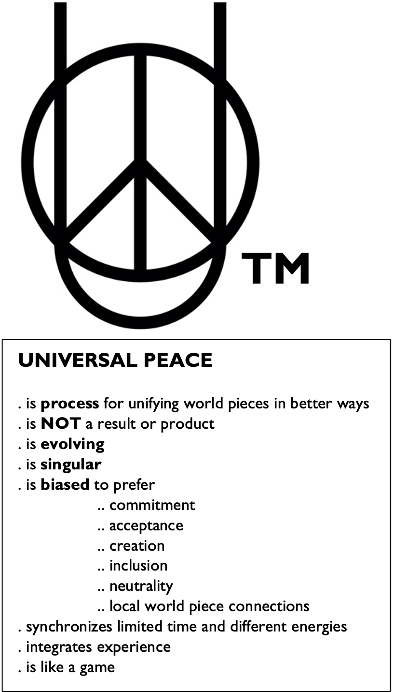

# the universal piece

This README contains copy pertaining to the universal piece as a concept in context of the time machine for peace invention project.

Symbol and defining characteristics of the universal piece:

